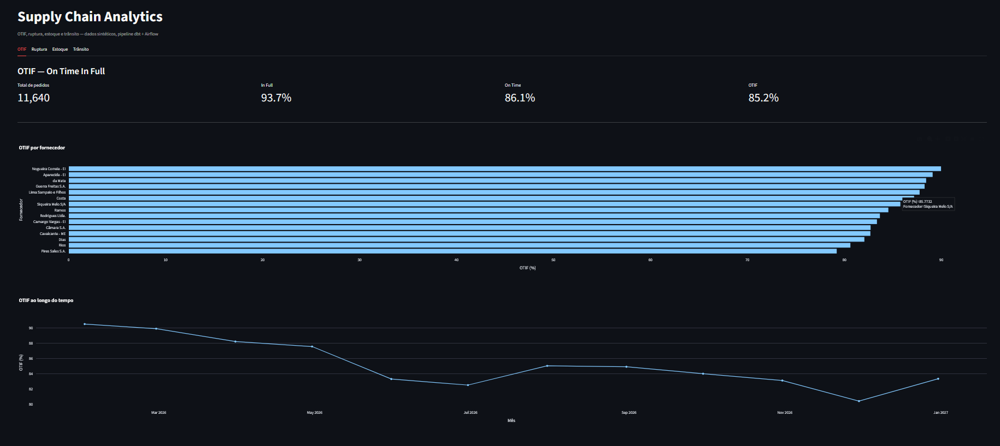
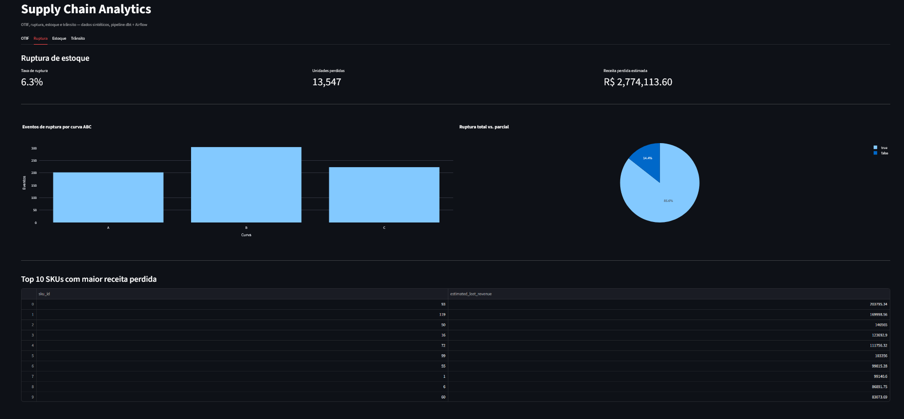
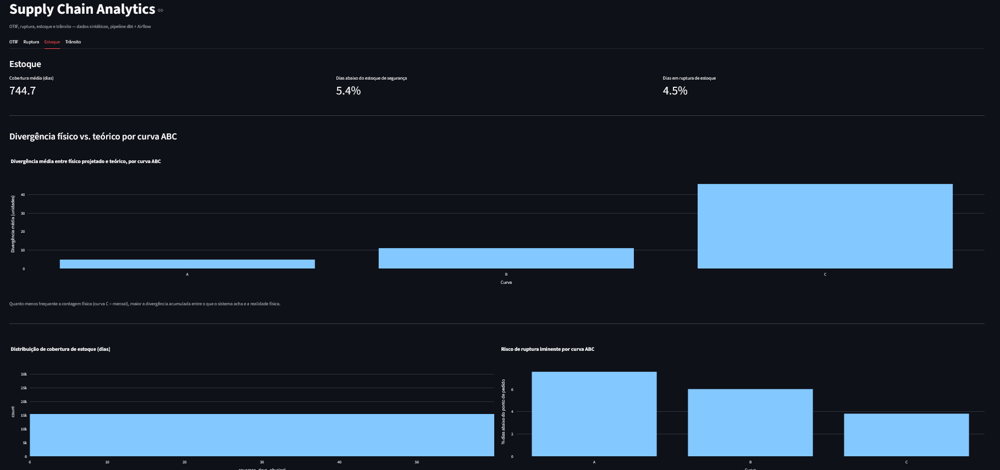
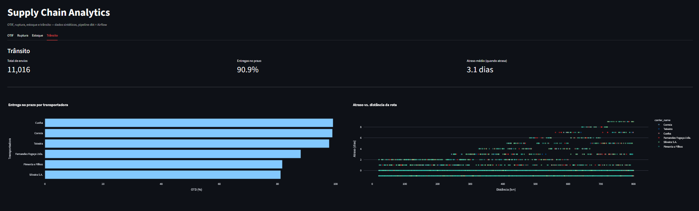

# Supply Chain Analytics Pipeline

*[Leia em português](README.pt-br.md)*

An end-to-end data engineering portfolio project simulating a distribution company's supply chain: synthetic data generation, orchestration with Airflow, transformation with dbt, all running on Docker.

The project focuses on four business areas that any supply chain operation cares about: **OTIF** (On Time In Full), **stockouts**, **inventory accuracy**, and **transit performance**.



## Why this project

Most portfolio data pipelines are built on top of a Kaggle CSV. This one generates its own data from scratch, with business rules that create realistic, analyzable patterns:

- Suppliers with varying reliability scores, which drive real delays and short shipments
- An ABC-curve-based physical count policy (daily / weekly / monthly), mirroring how real warehouses actually audit inventory
- A theoretical vs. physical stock divergence that grows the less frequently a SKU is counted
- Carriers with different on-time performance, affecting delivery to stores

The goal was not just to move data from A to B, but to build a dataset where the numbers tell a real operational story and then use dbt to reveal that story with tested, documented models.

## Business context

| Theme | What it represents | Key metric |
|---|---|---|
| OTIF | Orders delivered on time and in full | % OTIF, decomposed into on-time and in-full |
| Stockouts | Demand that couldn't be fulfilled from stock | Stockout rate, estimated lost revenue |
| Inventory | Stock levels and count accuracy over time | Coverage in days, physical vs. theoretical divergence |
| Transit | CD-to-store delivery performance | On-time delivery %, delay by carrier/route |

## Tech stack

- **Python** — synthetic data generation (pandas, numpy, Faker)
- **PostgreSQL** — data warehouse
- **dbt** — transformation (staging → intermediate → marts), tests, snapshots, incremental models
- **Apache Airflow** — orchestration, running on Docker via CeleryExecutor
- **Docker / Docker Compose** — containerized Postgres and Airflow, each in its own compose file

## Architecture

```
Python generator → Postgres (raw) → dbt staging → dbt intermediate → dbt marts
                                          ↓
                                   snapshot (SCD2)
```

Airflow orchestrates every step above as a single DAG: generate data → load to Postgres → clean dbt artifacts → install dbt packages → `dbt build` (snapshot, models and tests, in dependency order).

## Key technical decisions

**Physical stock projection ("islands and gaps").** Not every SKU is counted every day only Curve A products are. For days without a physical count, `int_inventory_physical_projection` propagates the last known physical count forward and adjusts it by the theoretical stock's movement since that count, using a classic SQL windowing technique (`sum() over ... rows unbounded preceding` to build count groups, then `max() over (partition by ... count_group)` to carry the last known value forward). This is Postgres-compatible in place of `IGNORE NULLS`, which Postgres doesn't support.

**ABC-curve-driven audit frequency.** Curve A (highest value) is counted daily, Curve B weekly, Curve C monthly mirroring real warehouse cycle-counting policy. The generator seeds a shrinkage rate that compounds with days since the last count, so Curve C products show meaningfully larger physical-vs-theoretical divergence than Curve A, which is exactly the kind of insight this project is meant to surface.

**SCD Type 2 snapshot.** The ABC curve is fixed in this dataset, but a dbt snapshot (`products_abc_curve_snapshot`) still tracks it with `dbt_valid_from` / `dbt_valid_to`, demonstrating the technique for a value that would change in production.

**Incremental model.** `stg_inventory_snapshots_incremental` only reprocesses rows newer than the last run's max date, instead of reprocessing the full 175k-row history every time the right default for a fact table that grows daily in production.

**Two dbt environments, one project.** dbt runs locally (for fast iteration) and inside the Airflow worker container (for orchestrated runs), on different dbt-core versions due to Airflow's dependency constraints. Both point at the same Postgres instance via `host.docker.internal`, with credentials injected via `.env`/`env_file`, never hardcoded.

## Project structure

```
supply-chain-analytics/
├── data_generator/          # Python scripts generating synthetic source data
├── dbt/supply_chain/        # dbt project (staging, intermediate, marts, snapshots)
├── airflow/                 # Airflow DAGs and Docker Compose setup
├── docker-compose.yml       # Postgres (data warehouse) container
└── docs/                    # Architecture diagram, data dictionary
```

## How to run

Prerequisites: Docker Desktop, WSL2 (Windows) or a Linux/Mac shell, Python 3.11+.

```bash
# 0. Credentials (read by the loader, dbt, the Makefile and the dashboard)
cp .env.example .env

# 1. Generate synthetic data
python -m venv .venv && source .venv/bin/activate
pip install -r data_generator/requirements.txt -r requirements-dev.txt -r streamlit_app/requirements.txt
python -m data_generator.main

# 2. Start Postgres
docker compose up -d

# 3. Load data
python -m data_generator.load_to_postgres

# 4. Run dbt (the Makefile exports .env and runs dbt deps && dbt build)
make dbt-build

# 5. Or run the whole thing via Airflow
docker compose -f airflow/docker-compose.yml up -d
# trigger the "generate_and_load_supply_chain_data" DAG at http://localhost:8080

# 6. Launch the dashboard
streamlit run streamlit_app/app.py
```

See [docs/data_dictionary.md](docs/data_dictionary.md) for the full schema.

## Results

On the generated dataset (120 SKUs, 4 warehouses, 25 stores, 365 days):

- **OTIF: 85.2%** (93.7% in-full, 86.1% on-time)
- **Stockout rate: 6.3%** of orders, concentrated similarly across ABC curves
- **Inventory divergence grows ~23x** from Curve A (daily counts) to Curve C (monthly counts) — direct evidence that count frequency drives inventory accuracy, not stockout rate
- **Transit on-time delivery: 90.9%**, varying by carrier reliability and route distance

### Dashboard screenshots

| OTIF | Stockouts |
|---|---|
|  |  |

| Inventory | Transit |
|---|---|
|  |  |

## Challenges along the way

Building this surfaced real integration problems, not just modeling ones:

- Docker network name collisions between two independently-composed Postgres services sharing a network
- SQLAlchemy 1.4 vs 2.0 incompatibilities between Airflow's pinned dependencies and newer libraries
- dbt-core version mismatches between local (1.12) and Airflow's constrained environment (resolved by pinning `dbt-postgres==1.9.1`, which pulled a compatible dbt-core automatically)
- A `click` library regression that broke Celery worker startup, fixed by pinning `click==8.2.1`
- Postgres `DROP TABLE` failing on cascading dbt-created views, requiring `CASCADE`

## License

MIT